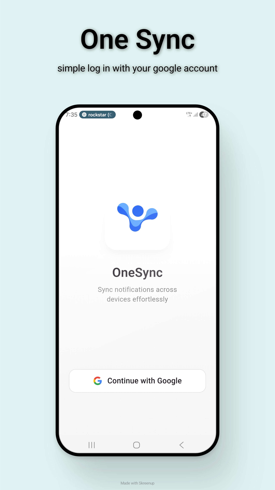
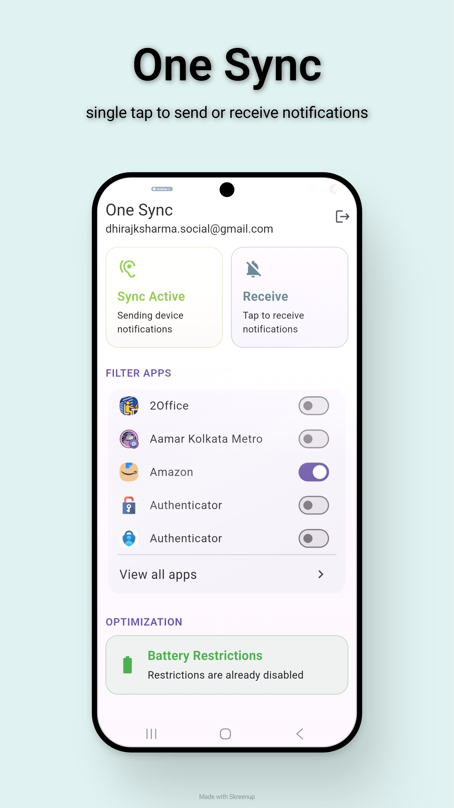
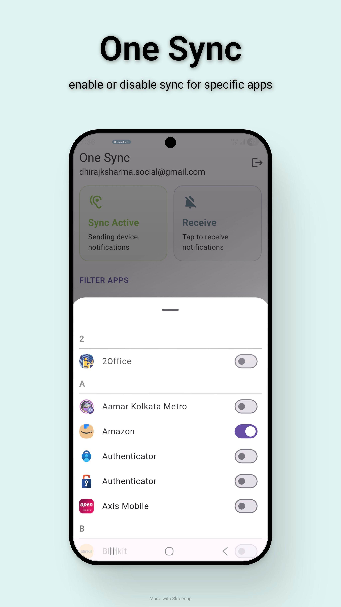

# OneSync

**OneSync** lets you sync notifications across your devices in real-time.
Receive important alerts from one device directly on another — seamlessly.

## ✨ Features

* 🔄 **Real-time notification sync**
* 📱 **Multi-device support**
* 🎯 **App-level filtering** (choose which apps to sync)
* 🔐 **Google Sign-In authentication**
* ⚡ **Lightweight and fast**

## 🚀 How It Works

1. Enable **Send Notifications** on one device
2. Enable **Receive Notifications** on another
3. Grant required permissions
4. Notifications will be synced instantly via cloud

## Screenshots
<table>
  <tr>
    <td></td>
    <td></td>
    <td></td>
  </tr>
</table>

## ⚙️ Setup

### 1. Download APK

Download the latest release APK from the repository and install it on your devices.

> Make sure "Install from unknown sources" is enabled.

**Note:** Google may block the installation since the app requests for notification access. One can bypass this by disabling play store first and then re-enabling it after installation.

### 2. Login

* Sign in using your Google account
* Use the **same account on all devices**

### 3. Permissions

Grant the following permissions:

* 📩 Notification access (required for sending)
* 🔔 Notification permission (required for receiving)

## 🛠️ Tech Stack

* Flutter
* Firebase Authentication
* Cloud Firestore
* Firebase Cloud Messaging (FCM)
* Firebase Cloud Functions

## 🔒 Privacy

* Notifications are **not permanently stored**
* Data is only used to relay notifications between your devices
* No third-party data sharing

## 🧪 Status

This is an early version (MVP).
Feedback and improvements are welcome!

## 🤝 Contributing

Feel free to open issues or submit pull requests.

## 📄 License

MIT License
